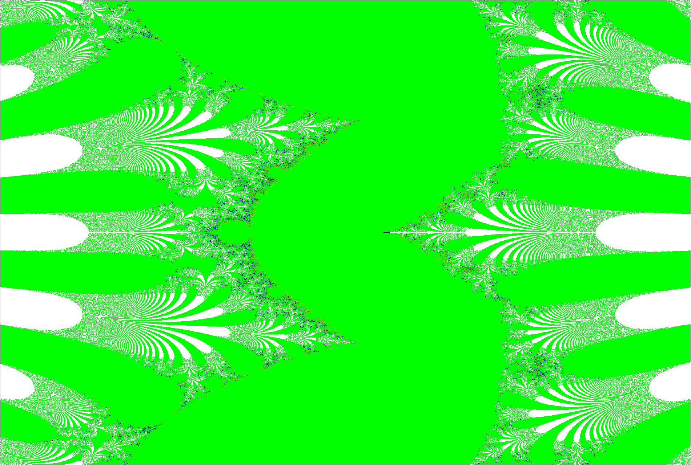

## Distributed Software Architecture (RSA)

# Task: [Zad20 Fractal](zad20-fractal.pdf)

The project represents generation of the Mandelbrot set. It's main goal is to implement multithreaded approach, so it can be executed on multiple cores.
The generate fractal look like this:

The specific scientific paper [here](rsa_project.pdf)

Results of test executions [here](results.xlsx)
